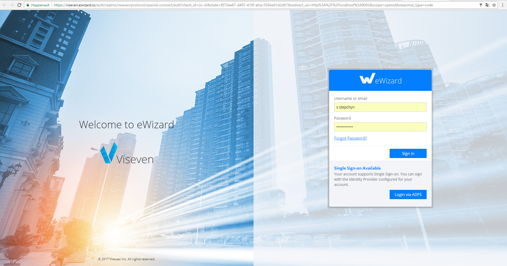
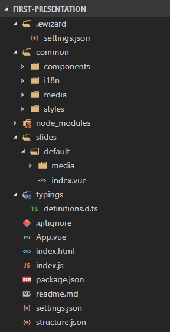
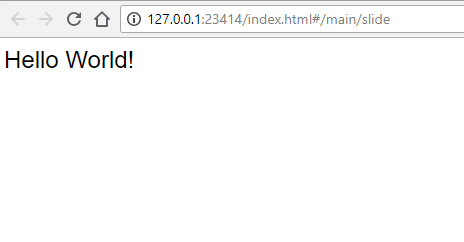
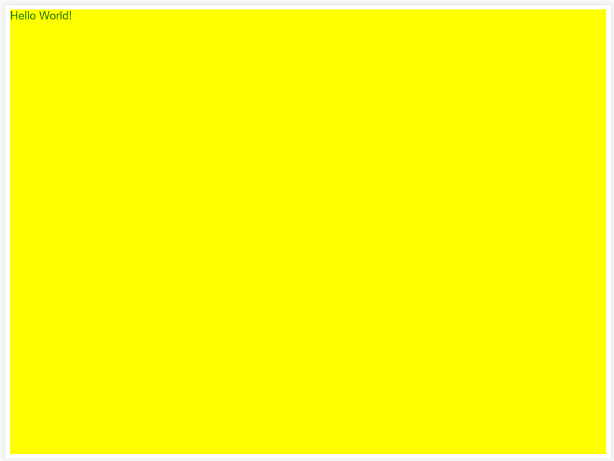
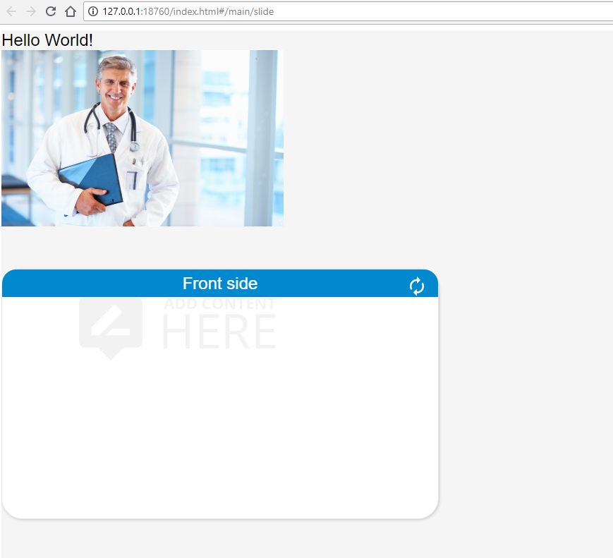
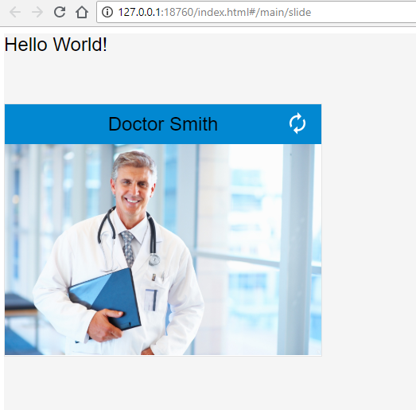

In this part of the tutorial you will learn how to:

* create simple presentations
* add editable text
* use different components on a slide

 As a result, you will have a presentation with images, eWizard components, and animation within slides. As this is a brief tutorial, all advanced functionalities will be described further.

## Presentation creation

Let's get prepared for creating our presentation. First of all, you need eWizard CLI to be installed on your computer. So, if it is not installed on your PC yet - here you can find the [installation tutorial](Installation.html). Since our environment is ready for use, we should create a folder for our presentation. Let's name our folder - `first-presentation`.

Open the command line in `first-presentation` folder and run the following command:

`wiz login`

This command allows you to get access to all the opportunities/functionalities for creating e-detailing content properly. As a result, after executing this command eWizard's Login page will be opened in the browser while console will be switched to the waiting mode.


```bash
info: Open this link in any browser to perform the operation:

https://auth.ewizard.io/auth/realms/viseven/protocol/openid-connect/auth?client_id=co-cli&state=86e52e2c-140f-454d-8e3b-6798200bdb66&redirect_uri=http%3A%2F%2Flocalhost%3A9005&scope=openid&response_type=code

info: Waiting for operation completion in browser...
PS C:\Users\default-user\Desktop>
```



In case it is not possible to open the browser from the console, you need to do it manually, an appropriate URL will be outputted in the console.
After successful login, you can close a browser and continue working with eWizard CLI:


Now we need to create a presentation, i.e. files and folders for presentation and its components. eWizard CLI provides the `wiz init` command which makes this manual work an automatized one. Let's execute this command in the same folder to initialize our first project:

`wiz init`

We will be asked some additional questions about settings of the project: template you want to use (email, edetailer, survey or component), usage of ESLing, description, name and author of the project. Let's choose project type `edetailer` and all other settings leave by default. In result, we will get a presentation with one chapter - `main` and one slide `cobalt`.

After initializing a presentation we can get familiar with the folder structure. Let's open a folder with a presentation in any IDE you want. The folder structure will look like the following one:



As you see, the `wiz init` command has created a few folders in the root of your presentation and a lot more inside them. We will look into all of them in details in the next articles.

Congratulations, you created a one-slide presentation! Read on to find out more about content development.

## Project running

To see how the presentation looks in a browser run the `wiz dev --watch` command in the presentation root folder. It will continuously build project source files, so we will be able to see the changes in the browser without refreshing browser page. After that you should open the folder with a project using any local server you want: nginx, apache, e.t.c

## Adding basic html content and styles

Now let's go back to the IDE and open index.vue file (the first slide) which you can find in the `slides/default` folder.

As you can see, it is .vue file. Also, you may notice that some content is already present on a slide, it is automatically added by the engine. Tag `<wiz-text :text="$t('text')"></wiz-text>` which is placed inside <template></template> tag represents a string of text which is stated in `text` property of `en` object. Note that <template></template> is a tag where all the slide content should be placed, this tag should be the only one in the file and could not be removed.

Let's slightly change the greeting text to check the editability of our presentation. For such purpose, we should change the value of `text` property to "Hello World", for example. Since we have run `wiz dev --watch` command previously, it will automatically build edited files.

In the browser the slide should look as the following:



Whole source code of the slide will be the following:

```javascript

<i18n>
  {
    "en": {
      "text": "Hello World!"
    }
  }
</i18n>

<template>
  <div class="layout">
    <wiz-text :text="$t('text')"></wiz-text>
  </div>
</template>
<script>
export default {};
</script>
<style scoped></style>
```

Now, let's change the content formatting. As you may notice, styles for the particular slides should be described in the same file with the markup. However, if needed to apply style changes which should affect the whole presentation it is better to define them in `styles/main.css` file.

Getting back to content formatting, let's change the background of the slide together with the size and color of the text, so the CSS will look like the following:

```css
.layout{
  height:100%;
  background: yellow;
}

.wiz-text{
  color:green;
  font-size:120%;
}
```

After implementing above mentioned changes slide appearance will be the next:



The next step is adding media files (images, videos, fonts, PDFs, etc.). They have to be placed in the `slides/{slideName}/media` folder. The images for the specific slide are stored in the `media` folder which is situated in slide directory. However, if you want to use the same image on every slide, you should store it in `common/media/images` to reduce the size of the project. 

Since we want to use the image only on the first slide, let's add it to `slides/default/media` folder. After that, we can easily add an image to the slide markup with the use of standard HTML5 syntax. Further, we will learn how to use eWizard components instead of standard tags to improve editing possibilities.

```HTML
  
```

This is a standard HTML tag but with slightly different `src` attribute. This attribute is written with the use of Vue syntax in order to use the object instead of string paths to the images. Hence, to make our slide work, we should import the image to the slide and assign it to the doctorImage object:

```JS
<script>
  import doctorImage from "./media/images/doctorImage.jpg";

  export default {
    data() {
      return {
        doctorImage: doctorImage
      };
    }
  };
</script>

```
Note, do not forget to put an existing image in the appropriate folder, to make the code work.

Now, let's add some interactivity to our slide - install `wiz-flip` component to the presentation. Just run the command `wiz install wiz-flip` in the root project folder. You may need to stop the `wiz dev --watch` command, in such case just press Ctrl + C twice. Next thing we should do -link the component on a slide - just add the following string inside the script tag:

```JS
import wizFlip from "wiz-flip";
```
and also we should register the component on a slide - hence, we should add `wizFlip` object to components object:

```JS
export default {
  components: {
    wizFlip
  },
  ....
};
```

The next thing we should paste the wiz-component into slide's markup, right after img tag:

```HTML
	<wiz-flip :is-flipped="false"
            :show-flip-button="true"
						type="vertical"
						class="flip"></wiz-flip>
```
In further articles we will describe how to change every of the component attributes, but for now, let's do not dive into them.

Finally, we need to slightly modify the default styling of `wiz-flip` component and remove yellow background:

```CSS
.flip {
  width: 620px;
  height: 355px;
  margin: 60px 0 100px;
  align-self: center;
}

.layout {
  height: 100%;
  background: whitesmoke;
}
```
Note, if you want to stylize some component, you should use css-class as a selector instead of original tag - it is our framework feature.

In the browser, the result will be the following:



Now, let's embed doctor image into `wiz-flip` component to use the component functionalities in full. Also, let's change slide styling and add a new string of text to the slide to make it more production-ready.

It is better to start from adding a new string of text, let's name it `doctorsName` and add to `en` object:

```JSON

 {
    "en": {
      "text": "Hello World!",
      "doctorsName":"Doctor Smith"
    }
  }

  ```

The next thing, we need to do is to change the markup. It will be looking at the following one:

```HTML
<template>
  <div class="layout">
    <wiz-text :text="$t('text')"></wiz-text>	
		<wiz-flip :is-flipped="false" :show-flip-button="true" type="vertical" class="flip">
			<div id="front" slot="front">
				<div class="flip-header">	
					<wiz-text :text="$t('doctorsName')" class="flip-header-text"></wiz-text>
				</div>
				<div class="content">
          <wiz-image :src="doctorImage" class="image"></wiz-image>
				</div>
			</div>
			<div id="back" slot="back">
				<div class="flip-header">
					<wiz-text :text="$t('doctorsName')" class="flip-header-text"></wiz-text>
				</div>
				<div class="content">
					<wiz-image :src="doctorImage" class="image"></wiz-image>
				</div>
			</div>
		</wiz-flip>
  </div>
</template>
```
As you can see there are a lot of nested tags inside of `<wiz-flip></wiz-flip>` tag. If we open `node_modules/wiz-flip/index.vue` file, we will see the template of the component and inside it, we can find `<slot>` tag with some ids. Due to these tags, we are able to paste any other tags inside the component, particularly div blocks and inside of them we can paste any other wiz components.

Finally, we need to add a few CSS rules to make the styling more user-friendly:


```CSS
.flip {
  width: 400px;
  height: 318px;
  margin: 60px 0 100px;
  align-self: center;
}

.flip-header {
  display: flex;
  flex-direction: row;
  justify-content: center;
  width: 100%;
  height: 50px;
  background-color: #0288d1;
}

.flip >>> .side {
  border: 1px solid #e4e4e4;
  border-radius: 0;
  box-shadow: none;
}

.slider {
  margin-top: 20px;
}

.layout {
  height: 100%;
  background: whitesmoke;
}

.wiz-text {
  color: green;
  font-size: 120%;
}
```
In browser, all these stuff will be looking as the following page:



Introduction part of the tutorial is finished. If you want to know more about developing e-Detailing content, you are free to move forward to the next chapters or you can try to create some presentation on your own.