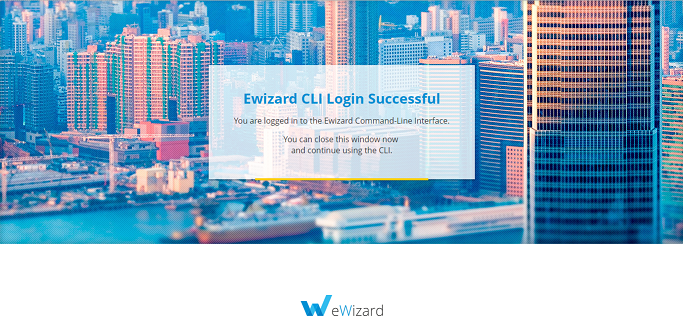

# Installation

## Presetting

For successful eWizard CLI installation, you should have the Node.js platform installed on your local PC. Visit the [official website](https://nodejs.org/en/) to download the latest version. 
::: warning Note!
We strongly recommend to use the LTS version, as any other version may cause errors while working with eWizard CLI.
:::

Also, verify the availability of the Git system. To download it, click [here](https://git-scm.com/).

## Installing 

To download the eWizard CLI, use the command prompt as administrator and run the following command: 
```
npm install -g ewizard-cli
```

This command will download all required modules and install them globally on your local PC.

## Starting

After installing the eWizard CLI you have to authorize. For this, use the command below:

```
wiz login
```

It will open the page in your default browser where you have to enter your login and password.
After successful authorization, you will see the next page.



