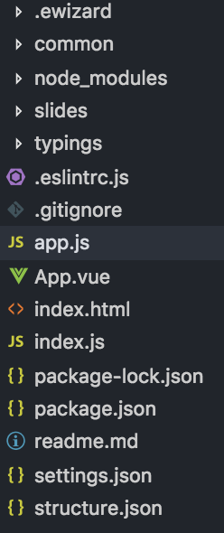

# Migration from vue-engine to eWizard.js

## Updating package.json file
1. Delate “navigator”, “standard-monitoring”, “vue”, "vue-engine", "init-editor" from dependencies
2. Add new dependency: 
```json
    "ewizardjs": git+https://git@git.qapint.com/ewizardjs/ewizardjs.git#3.0.0
```

## Updating App.vue file
Replace
```js 
import { vViewer } from "vue-engine";
```
by
```js 
import { vViewer } from "ewizardjs/navigator";
```

## Updating index.html file
Change all scripts before the closing tag body to

```html
<script src="./build/dev/app.js"></script>
<script src="./build/dev/index.js"></script>
```


## Updating index.js file
1. Change the imports from vue-engine to eWizard.js
```js 
import { Touch } from 'ewizardjs';

import { SettingsPlugin } from 'ewizardjs/settings';

import { get as getSettings } from 'ewizardjs/settings';

import { Navigator, NavigatorPlugin, Router} from 'ewizardjs/navigator';

import { Structure } from 'ewizardjs/structure';

import { Monitoring } from 'ewizardjs/monitoring';
```
2. Create app.js file in the root folder
    
    
    <br>
    - Move the imported plugins, components, modules from index.js to app.js. <b>VueRouter and VueI18n leave in index.js file.</b> 

    - The structure shoud be created before the settings:
        
        ```js
        const structure = new Structure(structureJson);

        const settings = getSettings(structure); // without "new" keyword
        ```        
    - Add export function:
        ```js
        export function createAppComponent(Vue, router) {...}
        ```
        - Use plugins, components, modules, etc, through ```Vue.use```, ```Vue.component```
            
            <b>Example:</b>
            ```js
            Vue.use(NavigatorPlugin);

            Vue.use(Touch, settings.navigation.swipe);

            Vue.use(SettingsPlugin, { structure });
            ```          
        - Create the router and navigator
            ```js
            const appRouter = new Router(structure, Vue, undefined, router);
            const navigator = new Navigator(appRouter, structure, settings);

            ```
        - Return the object from the function
            ```js
            return { wizApp, router: appRouter, navigator, options: {
                navigator,
            } };
            ```
            The ```options``` field can be completed by any parameters, they will be transmitted to the ```new Vue``` object.


<br>

In ```index.js``` call the function from ```app.js``` file.
```js
import Vue from 'vue';

import content from 'Content';

import VueRouter from 'vue-router';

import VueI18n from 'vue-i18n';

Vue.use(VueRouter);

Vue.use(VueI18n);

const { wizApp, router, navigator, options } = content.app.createAppComponent(Vue, new VueRouter());

router.addRoutes(router.routes);

const i18n = new VueI18n({

  locale: 'en',

  messages: {},

});

new Vue(Object.assign(options, {

  el: '#app',

  components: {

    wizApp,

  },

  router: navigator.router,

  i18n

}));
```


## Examples

[https://git.qapint.com/ewizardjs/templates/edetailer/tree/master/template](https://git.qapint.com/ewizardjs/templates/edetailer/tree/master/template)

[https://git.qapint.com/ewizard-presentations/default-vue/tree/feature/independent-editor](https://git.qapint.com/ewizard-presentations/default-vue/tree/feature/independent-editor)

Update ewizard-cli to 0.2.5 from the [Git](https://git.qapint.com/ewizardjs/ewizard-cli).