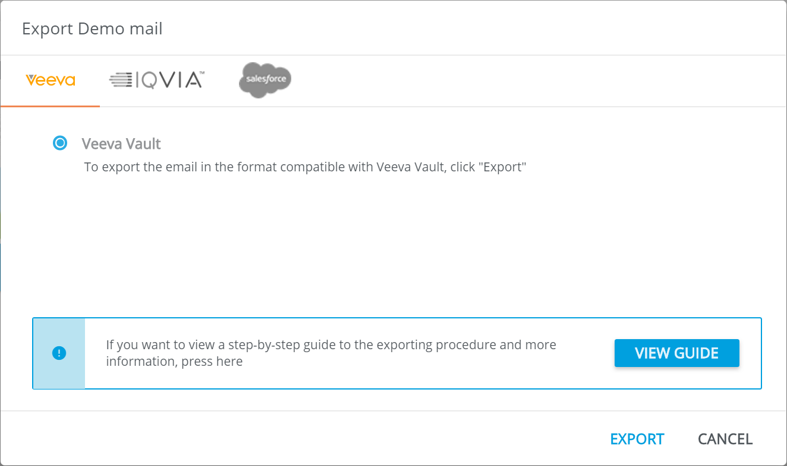
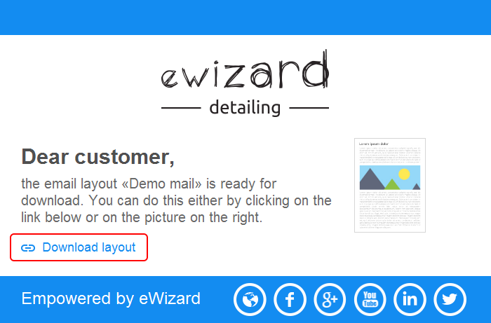

# Export:  Vault, IQVIA, SalesForce MC.

One of the main features of eWizard is a possibility to make an export of email template to the most popular CLMs. Before publishing your email template to any CLM you need to create an appropriate build of it. First of all you need to upload your email template to the eWizard platform. To export a template, select **Export** option in the **More** menu in the right corner of the top panel. You can export an email template to **CLM** or **Documents**.

**CLM** opens CLMs list available for export:

You will receive the report on the export results. For the successful export the report will contain the link to the archived template download:

Alternatively, you can download any successfully exported email template via the Details section (form the left side bar).
