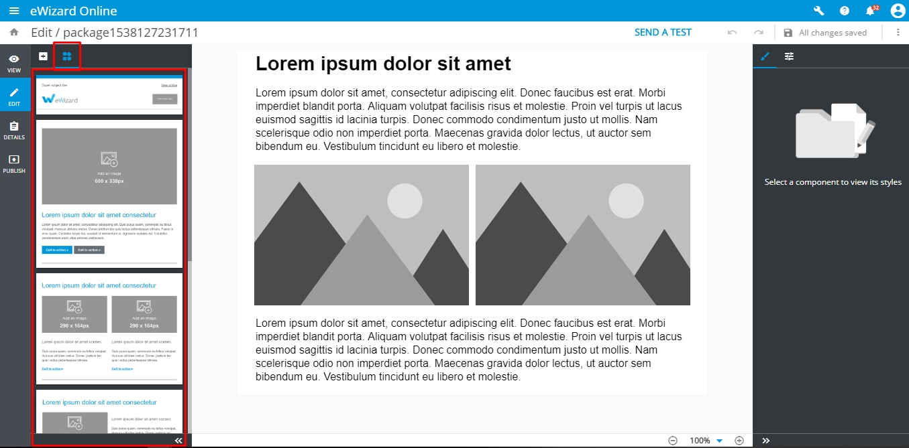
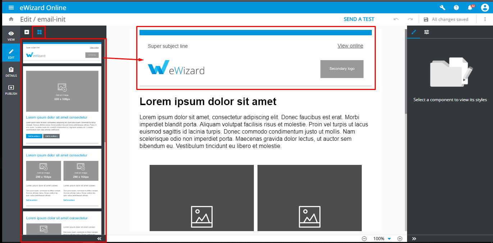

# Blocks

Blocks component are designed as ready to use pieces of ET markup with predefined content and styles that user may add to ET and edit in eWizard editor. The concept of blocks is to allow user quickly construct Email from the set of predefined elements with determined layout, and edit them using visual editor without having the issues with `<table>` markup. 

The blocks of ET are defined and stored as ET source files as vue components.

## Blocks library

By default initialized ET (created by `wiz init` command) already contains the set of simple blocks which are configured and ready for use in eWizard editor. 



All the blocks which serves as templates for adding in ET via eWizard are stored in `common/blocks-library/` folder. 

To be able view and [add]() the block from library in eWizard sidebar it should be registered in [blocks.json]() file.

The blocks-library folder has the following structure:

```bash
.
└─common/
   ├─ blocks-library/ # contains the blocks templates that are available to add to via editor
   |  ├─content-2m/ # the folder with block itself
   |  |  ├─public/ # contains media files to be used in the block markup
   |  |  | └─placeholder_290x290.jpg 
   |  |  ├─index.vue # vue-component that describes block markup
   |  |  └─icon.png # screenshot of a block that is displayed in eWizard editor sidebar
   |   ...
   |  └─blocks.json # the manifest with metadata of the blocks to display them in eWizard editor sidebar
   |
   └─ blocks/ # contains the blocks which are already added to the ET and can be edited in eWizard
      ├─content-2m-copy/ # block that can be imported to the slide and edited by user
      |  ├─public/ 
      |  ├─index.vue
      |  └─icon.png
      ...
```

### Block development

#### Block markup

The block itself represents simple vue component and is described in `index.vue` file of block' folder.
Lets try to create our first custom block component.
To do so, create a folder `my-block` within `common/blocks-library/` folder.
The markup of block should be added to `index.vue` file. So create `index.vue` file within `my-block` with following structure.

```html
<i18n>
{
  "en": {
    "title": "<div style='line-height: 20px;text-align: left;'><span style='color:#0096db;font-size: 29px'>Lorem ipsum dolor sit amet consectetur</span></div>"
  }
}
</i18n>

<template>
  <table align="center" class="container m-full-width" cellspacing="0" style="padding-top: 20px; padding-bottom: 20px;width: 600px">
    <tr>
    	<td align="center">
    	  <wiz-layout align="center" class="content-2m border-collapse m-p-0">

    	    <wiz-layout :css="{minHeight: '10px'}">
    	    	<wiz-title class="m-p-lr-20 m-p-b-0" :text="$t('title')" link="https://viseven.com/" align="center" style="padding-bottom: 25px;"></wiz-title>
    	    </wiz-layout>

    	    <wiz-layout class="m-p-lr-20 border-collapse" :css="{minHeight: '2px'}">
    	    	<wiz-divider style="padding-top: 40px;" divider-color="#627076" :divider-height="2"></wiz-divider>
    	    </wiz-layout>

    	  </wiz-layout>
    	</td>
    </tr>
  </table>
</template>

<script>
	import placeholderImage from './public/default-image.jpg';

	export default {
		name: 'my-block',
		components: {},
		data: function () {
			return {
				placeholderImage
			}
		}
	}
</script>
```

Put the images which are used in the block to the `common/my-block/public/` folder. 

### Block metadata

The file `blocks.json` in root of `blocks-library` contains meta information with block description. The information denoted in the `blocks.json` file will be showed in ewizard editor, when user hover mouse upon the block in sidebar.
Each block from the  `blocks-library` should be described as an object in `components` array with following structure:

```json
"components": [
  {
    "id": "my-block", //the block component name from blocks-library/[block-name]/index.vue file
    "name": "My first Block", //stands for the block name in eWizard sidebar
    "model": {},
    "icon": "common/blocks-library/header-default/icon.png", // path to the block icon which will be displayed in sidebar
    "metadata": [ // the metadata to be displayed in tooltip that appears when user hover upon the sidebar
      {
        "id": "image_size",
        "label": "Image size",
        "value": "600 x 338px"
      },
      {
        "id": "title",
        "label": "Title",
        "value": "40 characters"
      },
    ]
  }
]
``` 
Each object in metadata is rendered as a new string with information in a tooltip. That information may help user to understand which type of content is presented in a block, and the content description and restrictions.
As result the following the sidebar tooltip of `my-block` will be displayed:


## Adding the block to ET.

If you are going to add any block from the block library, just copy its folder to the `common/blocks/` folder.

Then add the tag which corresponds block component name to ET markup:

```html{4}
<template>
<div align="center" class="editable-block">
  <wiz-layout>
    <my-block></my-block>
  </wiz-layout>
</div>
</template>

<script>
import image from './public/default-image.jpg'

export default {
	name: 'v-app',
	components: {},
	data() {
		return {
			image
		}
	}
}
</script>

<style>
	@import "common/styles/main.css";
</style>
```
To check the results run `wiz dev` command and open `./index.html` file in the browser:
Result 


## Adding the block via eWizard
<!-- 
So, the newly [created ET](./getting-started.html) with added header block will looks as following in eWizard.
 -->

To add the new blocks to ET, switch left sidebar to the `Blocks` tab and drag the block to the required position in ET.


How to add a block to the slide


