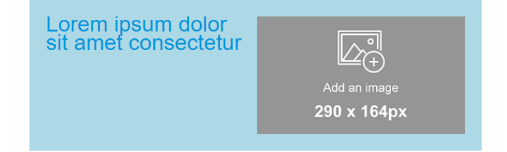
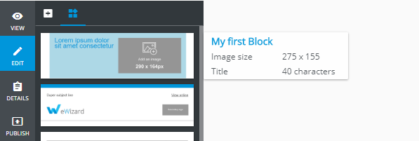
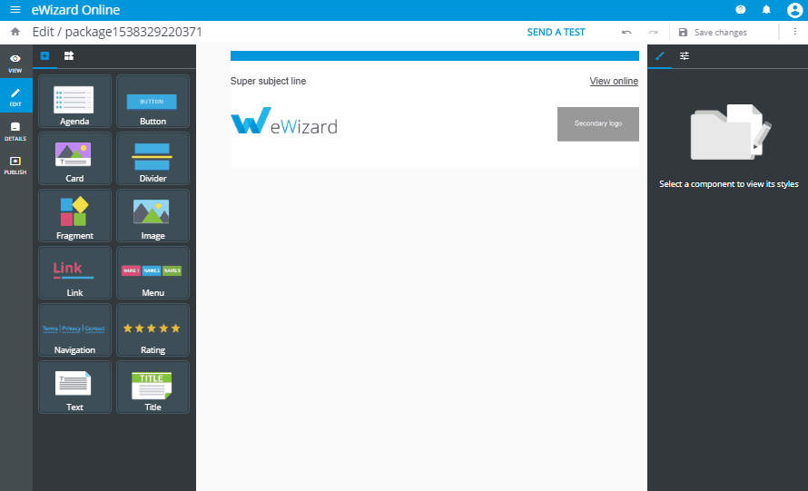

# Blocks

<style>
  .container-scrollable {
    max-height: 600px;
    overflow-y: auto;
  }
  .align-image-center > p{
    display:flex;
    justify-content:center;
  }
</style>

Block element stands for the ready to use piece of email template (**ET**) markup with predefined content and design. User can add block to **ET** and edit it in eWizard editor. The concept of blocks intends that user can quickly construct email from the set of predefined elements with determined layout and edit them using visual editor without having the issues with `<table>` markup and styling.

For now, all the blocks of **ET** are defined and stored in **ET** source files as vue components.

## Blocks library

By default, the initialized **ET** project (created by `wiz init` command) already has the set of simple blocks which are configured and ready for use in eWizard editor.


All these blocks are taken from the `common/blocks-library/` folder and serve as templates. Once user added the block to **ET**, the block component is being copied from the `blocks-library/` to `blocks/` folder.

The `blocks-library` and `blocks` folders have the structure as bellow:

```bash
.
└─common/
   ├─ blocks-library/ # contains the blocks templates that are available to add via eWizard editor
   |  ├─content-2m/ # the folder with block itself
   |  |  ├─public/ # contains media files to be used in the block
   |  |  | └─placeholder_290x290.jpg
   |  |  ├─index.vue # vue-component that describes block markup and design
   |  |  └─icon.png # screenshot of a block that is displayed in eWizard editor sidebar
   |  ...
   |  └─blocks.json # the manifest with metadata of all the blocks to display them in eWizard editor sidebar
   |
   └─ blocks/ # contains the blocks which are already added to the **ET** and can be edited in eWizard
      ├─content-2m-copy/ # block that can be imported to the slide and edited by user
      |  ├─public/
      |  ├─index.vue
      |  └─icon.png
      ...
```

To be able to view and [ to add a block in eWizard ](#adding-the-block-to-**ET**), the block should be registered in [blocks.json](#block-metadata) file.

## Block development

### Block markup

The block itself is represented as a simple vue component and described in `index.vue` file of its folder.

Let's try to create our first custom block component.
To do so, create a folder `my-block` within `common/blocks-library/` folder.
The markup of block should be added to `index.vue` file within `template` tag. So, we should create `index.vue` file within `my-block` and add the preceeding code:

<div class="container-scrollable">

```html
<i18n>
{
  "en": {
    "title": "<div style='line-height: 20px;text-align: left;'><span style='color:#0096db;font-size: 29px'>Lorem ipsum dolor sit amet consectetur</span></div>"
  }
}
</i18n>

<template>
  <wiz-layout align="center" type="horizontal">
    <wiz-layout :css="{minHeight: '10px'}">
      <wiz-text :text="$t('title')"></wiz-text>
    </wiz-layout>
    <wiz-layout  :css="{minHeight: '40px'}">
      <wiz-image :src="placeholderImage"></wiz-image>
    </wiz-layout>
  </wiz-layout>
</template>

<script>
import placeholderImage from "./public/default-image.jpg";

export default {
  name: "my-block",
  components: {},
  data: function() {
    return {
      placeholderImage
    };
  }
};
</script>
```

</div>

The code above contains block markup itself and the textual data that is stored in the `title` of `en` object and passed to `wiz-text`.

All media resources and `placeholderImage` that is passed to `wiz-image` should be stored in `my-block/public/` folder.

To see the result [add the block commponent to **ET** markup](#adding-the-block-to-et), rebuild the project (by running [wiz dev]() command) and open the `./index.html` in a browser.

### Block styling

To style the block component add `<style>` tag into its `index.vue` file and define there `css` code to fit the block content your design. It is a common practice to make a stylesheet with commonly used `css` classes and reuse them while developing the custom blocks.

Upon the necessity CSS code may be inlined in the HTML elements.

<div class="container-scrollable">

```html
<i18n>
{
  "en": {
    "title": "<div style='line-height: 20px;text-align: left;'><span style='color:#0096db;font-size: 29px'>Lorem ipsum dolor sit amet consectetur</span></div>"
  }
}
</i18n>

<template>
  <wiz-layout align="center" type="horizontal" class="my-block full-width border-collapse" :grid='layoutGrid'>
    <wiz-layout :css="{minHeight: '10px'}">
      <wiz-text :text="$t('title')"></wiz-text>
    </wiz-layout>
    <wiz-layout  :css="{minHeight: '40px'}">
      <wiz-image :src="placeholderImage" style="padding-right:20px; padding-bottom:20px"></wiz-image>
    </wiz-layout>
  </wiz-layout>
</template>

<script>
import placeholderImage from "./public/default-image.jpg";

export default {
  name: "my-block",
  components: {},
  data: function() {
    return {
      placeholderImage,
      layoutGrid: [
        { paddingTop: "20px", paddingLeft: "20px" },
        { paddingTop: "20px" }
      ]
    };
  }
};
</script>
<style>
.my-block {
  background-color: lightblue;
}
.border-collapse{
	border-collapse: collapse;
}
</style>
```

</div>

Result:



To manipulate styles of the elements, eWizardjs component `wiz-layout` has special props such as:

- `css` - used to pass the styles inlined in the root element of `wiz-layout` component;
- `grid` - used to pass inlined styles to table cells that wraps nested elements of `wiz-layout`;

Refer to [`wiz-layout` props](https://git.qapint.com/ewizardjs/email/components/wiz-layout/blob/master/index.vue#L12) to get acquainted with props syntax, format and explanation.

### Block metadata

eWizard editor takes out the information about the blocks from the file `blocks.json` in root of `blocks-library` folder and add all the blocks denoted in `blocks.json` to sidebar.

Also, `blocks.json` contains meta information with block content description. That information is showed in when user hover the mouse upon a block in sidebar.

Each block from the `blocks-library` should be described as an object in `components` array of `blocks.json` file with the following structure:

```json
"components": [
  {
    "id": "my-block", //the block component name from blocks-library/[block-name]/index.vue file
    "name": "My first Block", //stands for the block name in eWizard sidebar
    "model": {},
    "icon": "common/blocks-library/my-block/icon.png", // path to the block icon which will be displayed in sidebar
    "metadata": [ // the metadata to be displayed in tooltip
      {
        "id": "image_size",
        "label": "Image size",
        "value": "275 x 155"
      },
      {
        "id": "title",
        "label": "Title",
        "value": "40 characters"
      },
    ]
  }
]
```

Each object in metadata is rendered as a new string with helpful information, that appears when the user moves the mouse pointer over a block in sidebar. That information may help user to understand which type of content block has and to find out the content description and properties.

As a result, the following sidebar tooltip of `my-block` may appear:

<div class="align-image-center">



</div>

## Adding block to ET

If you are going to add any block from the block library to **ET** markup, just copy folder with a block to the `common/blocks/` folder.

Then add the tag which corresponds block component name to **ET** markup:

```html{3}
<template>
  <wiz-layout class="content-wrapper" style="border-spacing: 0; background: #ffffff; table-layout: auto" align="center">
    <my-block></my-block>
  </wiz-layout>
</template>

<script>

export default {
	name: 'v-app',
	components: {},
	data() {
		return {
		}
	}
}
</script>

<style>
	@import "common/styles/main.css";
</style>
```

To check the results run `wiz dev` command in the root of **ET** folder and open `./index.html` file in any browser.

:::tip
For develop purposes only, you can import the block' template directly from the blocks-library as below:

```js
import myBlock from "./common/blocks-library/my-block/index.vue";
export default {
  name: "v-app",
  components: {
    myBlock
  }
};
```

However, after completing the block development, it is recommended to add the block correctly (by copying the block to `common/blocks` folder), so user will be able to edit block in eWizard.
:::

## Adding block in eWizard editir

To add the new blocks to email, switch left sidebar to the `Blocks` tab and drag the block to the required position in email.



eWizard editor automatically adds the block from `block-library` to `common/blocks/` folder with a new name. Any changes applied to the block content are stored in `common/blocks/[block-name]/index.vue` file of the email.

