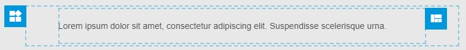

# Email components

## wiz-wrapper
 
The basic component used to wrap the content of Email Template. The `wiz-wrapper` should be added as the root element of `<template>`. 

Whenever user deletes all content from ET via eWizard `wiz-wrapper` remains the last, and cannot be removed. As result it rendered as container with image **Add content here**. The new elements may be added to that container again.

#### Usage
```html
<template>
  <wiz-wrapper class="content-wrapper" align="center" style="background: #ffffff; width: 700px; min-height: 100px;">
  <!-- add your content here -->
  <wiz-wrapper>
</template>
```
::: tip
The width and background colour of root element in ET are available for configuration in the `Settings` tab of eWizard editor.
:::

**Result**


## wiz-block

The `wiz-block` component is used to wrap the chunk of ET markup that represents a predefined editable element (that usually is called as a block) which user can add to the ET from the blocks tab of eWizard editor. Usually the `wiz-block` is used to create a blocks such as header, footer, signature etc. The new components from eWizard sidebar could be added into `wiz-block` too. Each component within boundaries of `wiz-block` can be selected for editing.

#### Usage

Add `wiz-block` to the template in `index.vue` file of a block component.

```html
<i18n>
{
  "en": {
    "main_text": "<div style='line-height: 20px;text-align: left;'><span style='color:#4d4d4d;font-size: 14px;font-family:arial,helvetica,sans-serif;'>Lorem ipsum dolor sit amet, consectetur adipiscing elit. Suspendisse scelerisque urna.</span></div>"
  }
}
</i18n>

<template>
  <wiz-block class="block content-2w border-collapse m-p-0" style="padding: 0 50px;">
  	<wiz-placeholder class="main-content-wrapper pa-0" style="min-height: 20px; padding: 20px 0;">
  	  <wiz-column :width="100">
  	    <wiz-text class="m-p-lr-20" align="left" :text="$t('main_text')"></wiz-text>
  	  </wiz-column>
  	</wiz-placeholder>
  </wiz-block>
</template>

<script>
	export default {
		name: 'content-2w'
	}
</script>
```

::: warning
Whenever the block is added to ET in eWizard, only the markup from its template will be pasted to ET markup (file App.vue). Thus, to style the block use css classes defined in ET or add inline styles.
:::

The preceding block added to ET will looks as follows:



## wiz-placeholder

The `wiz-placeholder` is a basic component that allows to create editable horizontal grid using eWizard visual interface. The `wiz-placeholder` may contain a multiple amount of [`wiz-column`](#wiz-column) and renders each column as a table cell. The table cells are rendered in horizontal row. Placeholder component can be used to create ET layout.

#### Usage

```html
<wiz-placeholder>
	<wiz-column></wiz-column>
	<wiz-column></wiz-column>
	<wiz-column></wiz-column>
</wiz-placeholder>
```

**Result**


## wiz-column

The `wiz-column` component is used in a pair with [`wiz-placeholder`](#wiz-placeholder) to group and display any type of content inside the columns. It is mandatory to nest `wiz-column` to `wiz-placeholder` if you are going to use them. The columns could be removed, added, resized in eWizard editor

#### API

The `wiz-column` has following props:

| Prop     | Type     | Explanation                                 
|----------|----------|-------------------------------------------
| `width`  | _Number_ | defines the column width in percent. The sum of columns' width within one placeholder always equals to `100` percent 
| `label`  | _String_ | defines the column label. Defaults to `Column`
| `align`  | _String_ | specifies the alignment of the content horizontally. In order to set column alignment, the passed value is added to **align** attribute of the table cell, so the [possible values](https://developer.mozilla.org/en-US/docs/Web/HTML/Element/td#Attributes) are the same as **align** attribute of `table` has. Defaults to `center`											

When the user change `width` of a column, component, emits `resize` event with a new width value of the column as payload.

#### Usage

```html
<wiz-placeholder>
	<wiz-column></wiz-column>
	<wiz-column></wiz-column>
	<wiz-column></wiz-column>
</wiz-placeholder>
```
## wiz-layout

The `wiz-layout` is a component that is used to lay out the content in a table. Each item in between the `wiz-layout` tags is distributed in the table cells. The `wiz-layout` cannot be selected directly for editing in eWizard.

::: tip 
Each item passed to the slot of `wiz-layout` is rendered in a row or column (which depends on `type` prop), so to create the complicated layouts may be used nested `wiz-layout`components with different `type` prop
:::

#### API

| Prop     | Type       | Explanation                                 
|----------|------------|-------------------------------------------
| `type`   | _String_   | Indicates the direction of content layout. <br><br>`horizontal` - lay out all content in a single row (each item will be rendered in the same row as table cell). <br><br>`vertical` - lay out the content in a column (each item will be rendered in a new row as a table cell). Defaults to `vertical`.
| `align`  | _String_	| Specifies how the cell content's horizontal alignment will be handled. Possible values are the same as [align](https://developer.mozilla.org/en-US/docs/Web/HTML/Element/td#Attributes) attribute has.
| `width`  | _String_   | Specifies the width of `wiz-layout` itself
| `css`	   | _Object_	| This prop may contain an object which is described according to vue [Object syntax](https://vuejs.org/v2/guide/class-and-style.html#Object-Syntax-1) that specifies style information of a `table` produced by `wiz-layout`. Styles described in `css` object are applied as table inline styles.
| `grid`   | _String, Array_ | The property may contain an array of objects with style information of the table cells (each cell wraps `wiz-layout` item). Styles described in array' object are assigned to aproprative cell.

::: tip
The grid prop is commonly used to manipulate the styles of multiple table cells produced by `wiz-layout` component. Use it to specify layout of `wiz-layout` items by setting width, padding etc of table cells (which helps to create some sort of grid) 
:::

#### Usage

```html

```