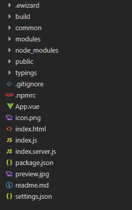

# :email: Getting started

## Preconditions

Before starting the development be sure that you have installed the latest version of eWizard CLI. More detailed information about eWizard CLI installation you can find [here](./Introduction.html). 

## Beginning of work

Firstly, create the folder which will store your email's content. After that open a command prompt in the root of the created folder and run the following command: 
```
wiz init
```
This command will initialize a template you choose. For the email template development, you have to choose an email from the suggested menu. 
``` {2}
? Choose template you want to use: (Use arrow keys)
   > email
     edetailer
     survey
     component
```
Also, you will be asked questions about directory where your project will be generated, description, name and author of the created email template. After successful initialization, your project structure should have the same view as on the image below: 



## How to see the results?

Use the **wiz dev** command to run the development build and check the created email template. Open index.html file in any browser to see the result.


By following these steps, you have created your basic email template. You can continue the work and fill with content you want by using different wiz-tools. 