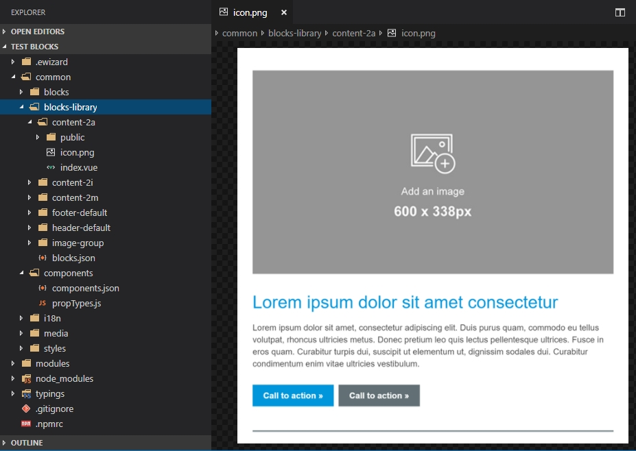

# :email: Getting started

## Preconditions

Before starting the development be sure that you have installed the latest version of eWizard CLI. More detailed information about eWizard CLI installation you can find [here](../Installation.html). 

## Beginning of work

Firstly, create the folder which will store your email's content. After that open a command prompt in the root of the created folder and run the following command: 
```
wiz init
```
This command will initialize a template you choose. For the email template development, you have to choose an email from the suggested menu. 
``` {2}
? Choose template you want to use: (Use arrow keys)
   > email
     edetailer
     survey
     component
```
Also, you will be asked questions about the directory where your project will be generated, description, name and author of the created email template. After successful initialization, your project structure should have the same view as on the image below: 


## How to see the results?

Use the **wiz dev** command to run the development build and check the created email template. Open index.html file in any browser to see the result.


By following these steps, you have created your basic email template. You can continue the work and fill with content you want by using different wiz-tools.

## Usage of blocks and components 

While developing an email template you can use predefined parts of an email. They are divided into two types:

* blocks (fragments)
* components

Blocks or fragments are already made sections of HTML page layout such as header, footer, etc. You can just paste them into your email page markup as a **tag** and a whole block with ready text and images will be located in your email. All installed blocks are described in *common/blocks-library/fragments.json* file.



Components are just little elements to add some interaction into email's markup. For example, it can be a button, carousel or a card with text. these elements are also used in blocks. The list of installed components is described in *common/components/components.json* file.
For clarity, open your eWizard account, go to the Email Templates tab and open any of an email template in edit mode. There you can see two tabs with components and blocks.


More detailed information about components is described in Email components article.

## Basic styling

The main file with common styles is located in *common/styles/main.css* file. There you can also stylize some blocks or components. In addition, you can create your own .css file and import them as it is shown in the example below. 
``` vue{2}
  <style>
    @import "common/styles/main.css";
  </style>
```

However, the best way - do it directly in the code of the specific fragment or component. For this, paste a **style** tag in the index.vue file of the component and write a css code inside of it. Use the **scoped** attribute for applying the CSS to elements of the current component only.
``` vue
<style scoped>
<template>
  <div class="example">Hello eWizard.js</div>
</template>

.example {
  color: red;
}
</style>
```


